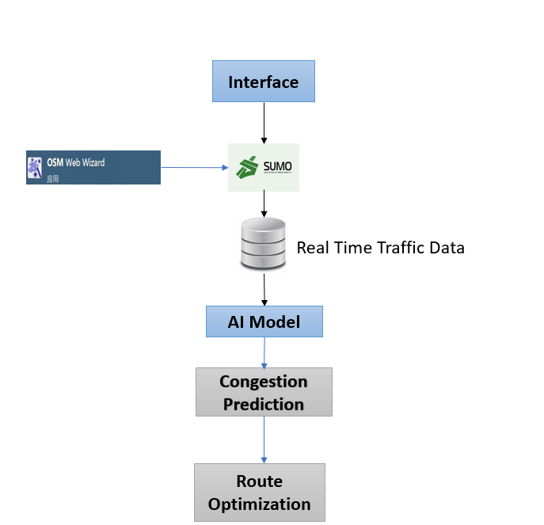

  <h1>🚦 V2I-Based Traffic Congestion Prediction and Route Optimization</h1>
  
  
  
  
  
  [-green)](https://www.tensorflow.org/)

---

## 📖 Overview

Urban traffic congestion causes serious problems like delays, fuel wastage, and pollution. This project leverages **Vehicle-to-Infrastructure (V2I)** communication and **LSTM-based AI prediction** to provide real-time congestion forecasting and route optimization.

It uses **SUMO** for traffic simulation and dynamically calculates the best paths using live and historical data. The system is visualized through an interactive **web-based GUI** and responds to traffic conditions in real-time.

---

## 🚗 Key Features

- Real-time traffic monitoring using **V2I communication**
- **AI model** (LSTM) to predict congestion patterns with ~90% accuracy
- **Dynamic rerouting** of vehicles using Dijkstra's algorithm
- Traffic simulation with **OpenStreetMap + SUMO**
- Interactive dashboard for monitoring live vehicle data, congestion stats, and rerouting
- Scalable and modular backend using Python + Flask

---

## 🧠 System Architecture

1. **Network Generation** – OpenStreetMap + SUMO
2. **V2I Communication** – Vehicle-to-RSU messaging via TraCI
3. **Real-Time Data Storage** – Stored in CSV and used for training
4. **AI Traffic Prediction** – LSTM model for time-series traffic forecasting
5. **Route Optimization** – Dijkstra's algorithm for dynamic rerouting
6. **Web Dashboard** – GUI interface for control and visualization

---

## 🛠️ Tech Stack

| Component         | Technology               |
|------------------|---------------------------|
| Programming Lang | Python 3.9+               |
| Simulation Tool  | SUMO + TraCI              |
| AI Framework     | TensorFlow (LSTM)         |
| Backend API      | Flask                     |
| Data Handling    | Pandas, NumPy             |
| Visualization    | Matplotlib + Tkinter GUI  |
| Routing Logic    | NetworkX (Graph Ops)      |
| Data Storage     | CSV, Real-time XML logs   |

---

## 📂 Project Structure

---

## 🧩 Installation Guide
### 1. ✅ Install SUMO

- Download from: [https://www.eclipse.org/sumo/](https://www.eclipse.org/sumo/)
- Installation guide: [https://sumo.dlr.de/docs/Installing/index.html](https://sumo.dlr.de/docs/Installing/index.html)
- Ensure `sumo` and `sumo-gui` are in your system PATH

### 2. 🌍 OpenStreetMap Web Wizard

- Access the OSM Web Wizard here:  
  👉 [https://sumo.dlr.de/docs/Tutorials/OSMWebWizard.html](https://sumo.dlr.de/docs/Tutorials/OSMWebWizard.html)
- Download `.net.xml` and `.rou.xml` files
- Use `netconvert` tool if converting OSM manually

---

## 📊 Results

- **Prediction Accuracy**: Approximately **90%** using LSTM on time-series traffic data

### 📈 Dashboard Insights:
- Real-time speed and waiting time graphs
- Rerouted vehicle analytics (pie charts, tables)

### 🚦 Optimization Achieved:
- Around **19.6% of vehicles** were rerouted successfully
- Reduced vehicle idle time and improved overall traffic throughput

### 📊 Visualization Tools:
- **Matplotlib**
- **Tkinter GUI**

---

## 🔮 Future Enhancements

- 🔧 Add real-world GPS and IoT traffic sensors
- ☁️ Cloud-based deployment for large-scale traffic networks
- 📱 Mobile app integration for route guidance
- 🧠 Edge AI on RSUs for instant rerouting decisions
- 🌧️ Traffic prediction with weather/accident event awareness

---

## 👨‍💻 Contributors

- 👤 **Peerappa Hadimani** – AI Model, Dashboard, Flask
- 👤 **Nishita Joshi** – SUMO Simulation, Routing
- 👤 **Deepa Hakare** – GUI, Integration
- 👤 **Kaveri Hanabar** – Testing, Visualization

Guided by 🧑‍🏫 **Dr. Satish Bhojannawar**

